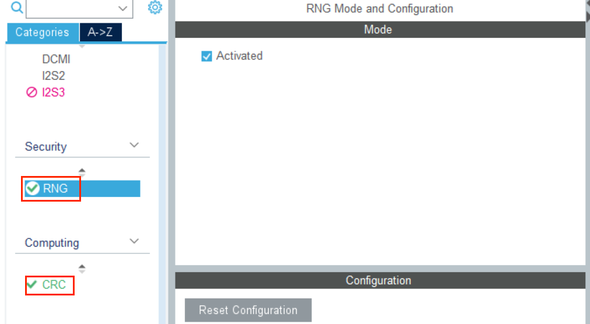

# 2023/8/28 周报

## 3、战队源码阅读

### 3.1 基础学习

(1)CRC和RNG使用



CRC：循环冗余校验，主要用来检测或校验数据传输或者保存后可能出现的错误。

RNG：随机数发生器。

具体内容查看[STM32CubeMX系列教程，关于随机数发生器RNG和循环冗余校验CRC的应用_cubmax可以生成代码crc校验是16位吗_weixuedianzi的博客-CSDN博客](https://blog.csdn.net/weixuedianzi/article/details/70143457)

（2）USB


（3）串口空闲中断

该项目中串口空闲中断的目的是通知处理器或微控制器，在数据帧传输结束后，可以进行后续的处理。


具体解释看：[STM32 HAL库学习（四）：DMA之串口空闲中断_stm32串口dma空闲中断_la_fe_的博客-CSDN博客](https://blog.csdn.net/la_fe_/article/details/100543141?ops_request_misc=%7B%22request%5Fid%22%3A%22169305692116800188529887%22%2C%22scm%22%3A%2220140713.130102334..%22%7D&request_id=169305692116800188529887&biz_id=0&utm_medium=distribute.pc_search_result.none-task-blog-2~all~sobaiduend~default-2-100543141-null-null.142^v93^insert_down1&utm_term=串口空闲中断&spm=1018.2226.3001.4187)

（4）局部变量数据溢出

解释：局部变量存储在栈中，不断增加局部变量的值，当栈空间耗尽时会发生栈溢出。栈溢出是一种程序错误，会导致程序崩溃或不可预测的行为。此时栈空间被逐渐占满，直到达到栈的上限，可能会覆盖其他栈帧、返回地址以及其他重要数据，导致程序异常终止。

（5）flash与eeprom

FLASH和EEPROM的最大区别是FLASH按扇区操作，EEPROM则按字节操作。现在的单片机,RAM主要是做运行时数据存储器,FLASH主要是程序存储器,EEPROM主要是用以在程序运行保存一些需要掉电不丢失的数据。

（6）两个单片机之间can通信

详见：[STM32---CAN通信协议实验详解（两块STM32F405之间CAN通信）_两块mcu进行can通信,需要做什么_阿槐123456的博客-CSDN博客](https://blog.csdn.net/weixin_43491077/article/details/110306660)


创建缓存区的好方法

（7）电机

6020：绝对编码器

3508、2006：上电编码器发送机械角度为0


### 3.2 配置功能分析

==UP文件：==

（1）TIM

TIM8：PWM-CH3 ，168MHz / 168 / 2M，舵机用于打开弹仓盖（频率是否问题，将period设置为199）

TIM10：PWM-CH1，168MHz / 84 / 2K，用于陀螺仪温度控制

（2）SPI1

陀螺仪采用SPI通信，SPI接收使能DMA。

（3）USART

//USART1

USART3：串口中断使能，空闲中断时处理遥控器接收信息。

//USART6

（4）CAN

can1：二维云台控制+摩擦轮控制。

can2：拨弹电机。

（5）EXTI

PB12引脚为外部中断

（6）说明

- FreeRTOS 的时钟节拍频率为 1000Hz。即 FreeRTOS 的任务调度器每秒会尝试执行任务调度 1000 次。但实际任务的运行速率会取决于任务的优先级、阻塞状态、抢占和其他因素。

- 四个任务的优先级相同，因此 任务间不存在冲突。


==DOWN文件==

//（1）SPI

（2）UART

//UART1

UART3：遥控器通信

//UART6

（3）CAN

CAN1：底盘四个电机的控制，向上层发送功率

CAN2：向上层发送裁判系统对SHOOT的供电情况


### 3.3 任务分析

==UP文件：==

1、首先系统时钟和cubemx配置的外设进行初始化，开始执行任务。

2、UART3接收中断开启，当接收到遥控器发来的数据包时，对数据包内容进行处理。

3、PB12引脚外部中断触发时，向上位机发送自瞄相关数据

3、ins任务读取陀螺仪数据，并通过四元数姿态解算更新陀螺仪的六轴数据。此外，该任务还对陀螺仪进行PID温控，保证陀螺仪温度在40℃左右。在ins任务开始之前已经对陀螺仪进行校准，如果零漂过大是无法开启任务的。

4、gimbal任务首先使用编码器反馈机械角度对云台进行归中。归中后通过遥控器的拨杆数据选择云台控制模式——自动或手动。

GIMBAL_INIT模式：云台归中，先在俯仰方向回中，后在yaw方向回中。回中完成后对自瞄和手动模式进行判断。

GIMBAL_CLOSE_LOOP_ZGYRO模式：通过遥控器发送的数据控制云台偏航角和俯仰角。

GIMBAL_AUTO模式：上位机通过USB虚拟串口发送处理好的二维云台角度数据。

GIMBAL_RELAX模式：云台离线，运动立即停止。各参数设为归中模式，回到GIMBAL_INIT模式。

（由于代码细节较难读懂，未逐行分析）

5、shoot任务通过遥控器发送键盘和摇杆的数据，选择射击模式为单发、三连发、连续射击、不射击，选择是否打开摩擦轮和弹仓盖。热量过高时，不发射子弹。串级PID（位置环+速度环）控制拨弹电机，PID控制摩擦轮电机的电流。任务对卡弹情况进行特殊处理。

6、transmission任务给底盘发送云台的相关信息：云台相对角度、云台控制模式、弹仓打开情况、射击完成情况。

7、detect任务进行异常检测，检测遥控器、云台偏航角、俯仰角、底盘电机（应该没有用到）、拨弹电机。根据两次检测相隔时间判断检测是否超时，如果超时，对优先级最高的异常事件进行处理。不同事件的异常处理方式不同。（源码中只对摩擦轮的异常进行了处理）

==DOWM文件：==

上层通过CAN2传输数据（yaw_relative_angle）给下层

1、UART3接收中断开启，当接收到遥控器发来的数据包时，对数据包内容进行处理。

2、chassis任务控制底盘，通过遥控器选择底盘控制模式：跟随、陀螺、飞坡、开环、停止。其中跟随云台模式根据上层发送的数据（云台偏航角相对角度）进行底盘控制。

3、transmission任务通过can2向上层发送裁判系统对SHOOT的供电情况，can1向上层发送功率限制并接收超级电容相关数据。


### 3.4 问题汇总

1.USB虚拟串口使用

​	USB与上位机通信。

​	鼠标和键盘通过遥控器实现。

2.ins_task（）函数部分代码

​	代码中count为32为无符号整型数据，最大值为4294967295，1ms（	1000Hz）左右加1。

​	4294967295/1000/3600=1193.05（h）

​	完全不用担心数据会溢出！！！  

3.USART3_IRQHandler（）函数空闲中断

​	==每次中断接收数据后，空闲中断只进入一次（详见3.1）。==

4.陀螺仪温控（TIM10-10Hz）的频率是否过小

​	影响较小，可以实验证明一下（注意控制单一变量）。

5.Ins和Gimbal任务是否存在冲突情况

​	各任务优先级相同，不存在冲突问题。

6.osPriorityNormal表示任务设置为中等优先级.，如果跟串口或其他外设

​	进行比较呢：中断优先级更高。

7.云台前馈控制，前馈量和计算模型（完全不懂）：未使用

8.变量rpy_rx_data赋值来源未知

​	其复制了上位机发送过来的数据。

```c
memcpy(&rpy_rx_data,&upper_rx_data,sizeof(rpy_rx_data));
```

9.云台归中

​	云台归中时，已经测试出云台归中时编码器发送的数值。机械角度数值范围在0~8191之间，即物理角度0°--360°


10.摩擦轮作用

​	发射子弹

11.向上位机发送的数据含义

​	发送云台角度的偏移量

12.HAL_CAN_RxFifo0MsgPendingCallback部分代码

​	YawMotor_Manual.msg_cnt++ <= 50原因为稳定后再运算（个人认为这段代码可以优化）

13.detect任务err_cnt复位问题

​	err_cnt复位位置有问题

14.摩擦轮异常检测未初始化

​	实操中没有用到错误检测，但确实应加上初始化。

15.对超级电容充放电的代码没有找到，UP文件中PF10引脚初始化，但未使用。

​	步兵由需要三个主控模块

主控1：分别与上位机和底盘主控板进行通信

主控2：分别与上层主控1、裁判系统、主控3进行通信

主控3：控制超级电容，与下层主控2进行通信

16.上下层通信问题：UP中发送为扩展帧，DOWN中接收用标准帧ID判断？？？


==很多地方还未仔细查看，如usb虚拟串口与单片机的通信部分==

